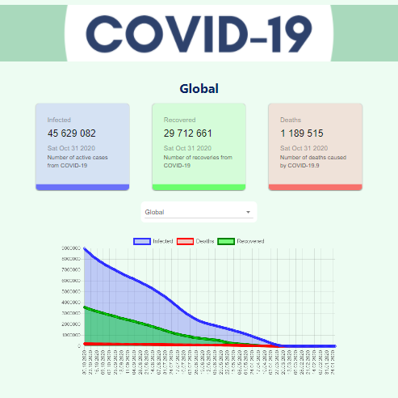

# COVID-2019 Tracker

## [Live demo](https://covid-tracker777.netlify.app/)

In this project I'm going to build a COVID-2019 tracker application using React.js, Material UI, Chart.js, API and much more. Mobile and tablet friendly.

API used: https://covid19.mathdro.id/api

## Setup:

### `npm i`
### `npm start`

